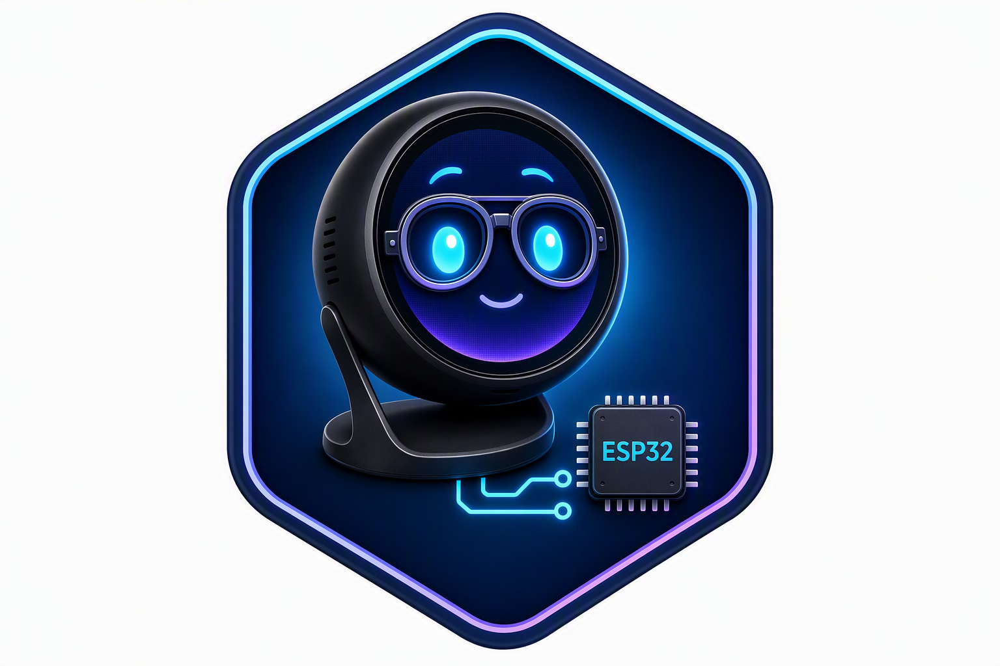

<p align="center">
  
</p>

# ESP32 Agent Companion

A small, expressive companion for your desk. Its first character is inspired by
GitHub Copilot and comes to life on a round AMOLED touchscreen: it looks around,
blinks, reacts when tapped, and can display Working, Complete, and Needs attention
states.

It runs locally on the **Waveshare ESP32-S3-Touch-AMOLED-1.75-B or 1.75-C**.
No Wi-Fi, cloud account, subscription, or microSD card is needed to run the
built-in character.

## What it does

- **Natural motion:** smooth 30 FPS playback, eight looking directions, and occasional blinks.
- **Touch reactions:** tap the character for a quick spring-like recoil and widened eyes.
- **On-device settings:** swipe up to adjust brightness or select a character state.
- **Agent states:** focused eyes and orbiting dots for Working, a celebration for Complete,
  and curious head tilts for Needs attention.
- **Compact graphics:** lossless sprite compression preserves the artwork while keeping
  the current sprite pack around 9.53 MB.
- **Optional microSD:** read-only loading of the matching sprite pack, with built-in
  flash assets as the fallback.

The character works immediately in automatic Idle mode. Agent states can be
controlled through USB serial commands or the swipe-up settings menu. **Automatic
integration with coding agents and additional characters are not implemented yet**.

<p align="center">
  
</p>

## Install

### 1. Get the device and download a release

You need:

- **Waveshare ESP32-S3-Touch-AMOLED-1.75-B or 1.75-C:** [Buy from Waveshare](https://www.waveshare.com/esp32-s3-touch-amoled-1.75.htm?sku=31262)
  or [Amazon](https://www.amazon.com/dp/B0FBWDL117).
- A **USB data cable** and a macOS, Windows, or Linux computer.
- **[Python 3.10 or newer](https://www.python.org/downloads/)**. On Windows, include
  the Python launcher when installing.

From [Releases](https://github.com/DanWahlin/esp32-agent-companion/releases/latest), download
the file ending in **`-firmware.zip`** and extract it. You do **not** need Arduino IDE,
Arduino CLI, or the source repository to install a release.

Prefer to build it yourself? Follow the [source-build guide](docs/build-from-source.md).

### 2. Install the flashing software

Open a terminal **inside the extracted firmware folder**—the folder containing
`flash.py`, `manifest.json`, and `requirements.txt`.

**macOS / Linux**

```bash
python3 -m venv .venv
.venv/bin/python -m pip install -r requirements.txt
```

**Windows PowerShell**

```powershell
py -3 -m venv .venv
.\.venv\Scripts\python.exe -m pip install -r requirements.txt
```

This installs the pinned `esptool` flashing utility into a local environment.
Some Linux distributions also require their `python3-venv` package.

### 3. Connect and flash

Connect the device using the USB data cable. Close any serial monitor using it.
List the ports, then flash the port corresponding to your device:

**macOS / Linux**

```bash
.venv/bin/python flash.py --list-ports
.venv/bin/python flash.py --port /dev/cu.usbmodem2101
```

**Windows PowerShell**

```powershell
.\.venv\Scripts\python.exe flash.py --list-ports
.\.venv\Scripts\python.exe flash.py --port COM5
```

Replace the example port with the one listed for your board. Linux ports commonly
look like `/dev/ttyACM0`; macOS ports commonly look like `/dev/cu.usbmodem...`.

**Confirm when prompted.** The installer checks the bundle's hashes and programs
the matching bootloader, partition table, application, and sprite `.bin` files at
their correct addresses. Do not upload the application `.bin` alone or mix files
from different releases.

**Flashing replaces the device's existing firmware and partition table.** Back up
anything needed from its previous firmware first. The installer does not run a
whole-chip erase or modify your microSD card.

When flashing finishes, the device restarts and the character begins looking
around. Tap it to try the touch reaction, or swipe up to open settings. The menu
adjusts display brightness and selects Idle, Surprise, Working, Complete, or
Needs attention. Swipe down or tap Close to return to the character.

If the device is not listed, check that the cable supports data. For connection or
download-mode problems, see the [Waveshare instructions](https://www.waveshare.com/wiki/ESP32-S3-Touch-AMOLED-1.75).

### Optional: add a microSD card

The built-in character already works without a card.

1. Use a **FAT32** microSD card. A 64 GB FAT32 card has been mounted successfully.
2. Download **`-sd-card.zip` from the same release** as your firmware.
3. With a card reader, extract its `copilot` folder onto the card's root. The file
   must be `/copilot/sprite-firmware.bin`.
4. Safely eject the card, insert it with the device powered off, then restart.

The firmware never formats or writes to the card, and the device does not expose
it as a USB drive. Missing or incompatible packs leave flash playback available.
This first implementation accepts the matching Copilot pack only; SD-backed
playback performance still needs verification with that file present.

## Develop and customize

The native browser preview uses the same C++ motion and rendering code as the
device. Source artwork, blink generation, and firmware export tools are included.

- [Build from source](docs/build-from-source.md)
- [Development, preview, hardware, and serial commands](docs/development.md)
- [Tagging and publishing releases](docs/releases.md)

This is an independent project, not an official GitHub or Waveshare product.
GitHub Copilot artwork and product names belong to their respective owners.
