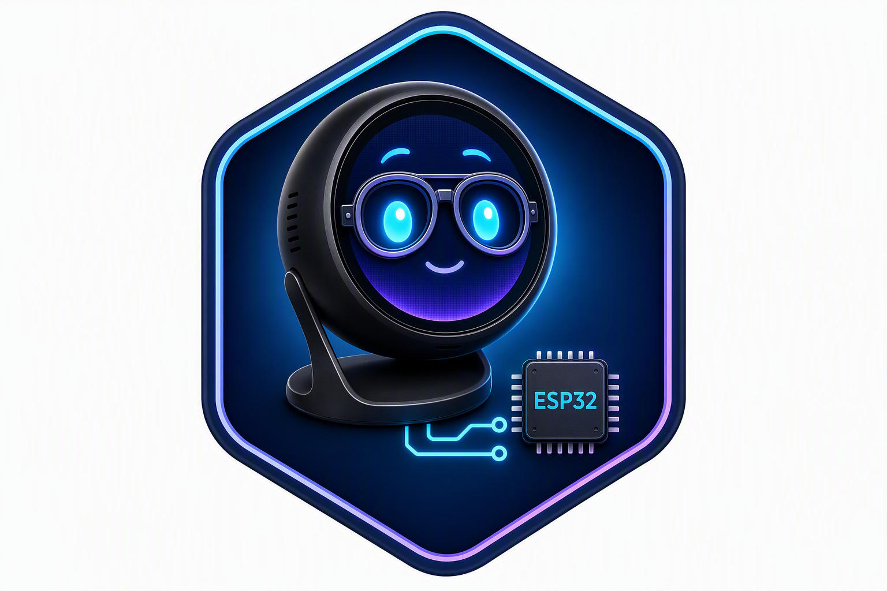
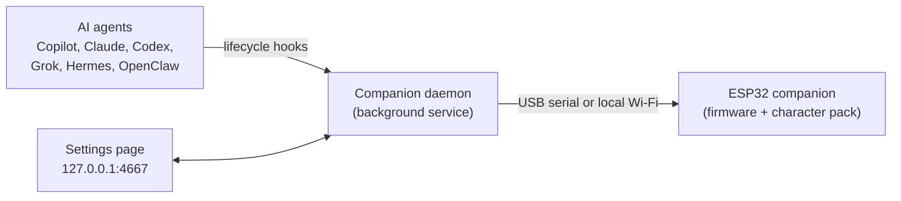
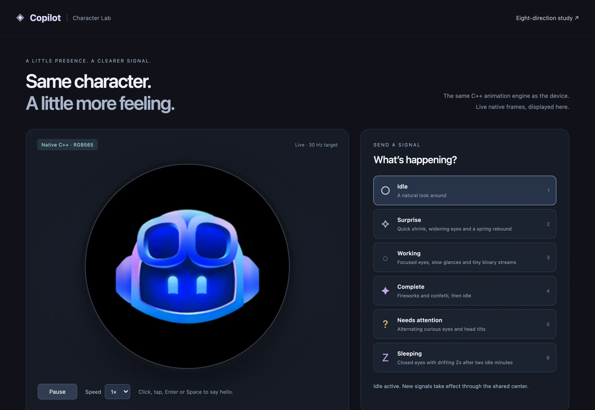

<p align="center">
  
</p>

<h1 align="center">ESP32 Agent Companion</h1>

<p align="center">
  An animated desk companion that shows what your AI coding agents are doing.
</p>

<p align="center">
  <a href="https://github.com/DanWahlin/esp32-agent-companion/releases/latest"></a>
  <a href="https://github.com/DanWahlin/esp32-agent-companion/actions/workflows/build.yml"></a>
</p>

ESP32 Agent Companion turns a
[Waveshare ESP32-S3 1.75" round AMOLED touchscreen](https://www.amazon.com/dp/B0FBWDL117)
into a character that reacts to your AI coding agents. When GitHub Copilot CLI,
Claude Code, Codex CLI, Grok Build, Hermes Agent, or OpenClaw starts working,
needs your approval, or finishes, the character shows it, along with a small
badge for the agent involved.

Everything runs locally. There's no cloud service, account, or subscription, and
the device works over USB or your local Wi-Fi.

Want it on your screen as well? The [Desktop Agent Companion](#desktop-agent-companion)
puts the same character, with the same animation, in a transparent window on your
desktop, with or without the device.

<p align="center">
  
</p>

## Contents

- [Features](#features)
- [How it works](#how-it-works)
- [What you need](#what-you-need)
- [Quick start](#quick-start)
- [Step 1: Flash the firmware](#step-1-flash-the-firmware)
- [Step 2: Install the companion daemon](#step-2-install-the-companion-daemon)
- [Step 3: Finish setting up your agents](#step-3-finish-setting-up-your-agents)
- [Step 4: Try it](#step-4-try-it)
- [Using the device](#using-the-device)
- [Agents](#agents)
- [Agent badges](#agent-badges)
- [Characters](#characters)
- [Wi-Fi](#wi-fi)
- [Update](#update)
- [Command reference](#command-reference)
- [Troubleshooting](#troubleshooting)
- [Desktop Agent Companion](#desktop-agent-companion)
- [Develop and customize](#develop-and-customize)

## Features

- **Agent-aware states:** Working, Needs attention, and Complete animations driven
  by your agents' lifecycle hooks, with sessions from several agents combined.
- **Agent badges:** small icons show which agent is working, waiting on you, or
  just finished.
- **Six supported agents:** GitHub Copilot CLI, Claude Code, Codex CLI, Grok Build,
  Hermes Agent, and OpenClaw.
- **Swappable characters:** the device holds one character pack at a time. It
  ships with Copilot, and you can install OpenClaw, Claude, or your own pack over USB or Wi-Fi.
- **Settings page:** a local web page for agents, badges, characters, Wi-Fi, and
  the connection mode.
- **Natural motion:** eight looking directions, blinks, touch reactions, and a
  sleep cycle after two idle minutes.
- **Wi-Fi or USB:** run it tethered to your computer or from any USB power source
  on the same network.
- **Optional sound:** short local sound cues through the board's speaker connector.

## How it works


```mermaid
flowchart LR
    A["AI agents<br/>Copilot, Claude, Codex,<br/>Grok, Hermes, OpenClaw"] -- lifecycle hooks --> D["Companion daemon<br/>(background service)"]
    B["Settings page<br/>127.0.0.1:4667"] <--> D
    D -- USB serial or local Wi-Fi --> E["ESP32 companion<br/>(firmware + character pack)"]
```

1. **Firmware** runs the animation on the device. You flash it once from a release.
2. **Hooks** in each agent's config report events such as "started a tool",
   "needs permission", and "finished".
3. **The companion daemon** runs in the background on your computer. It combines
   those events into one state, sends it to the device, and serves the settings page.

## What you need

| Item | Details |
| --- | --- |
| Device | **Waveshare ESP32-S3-Touch-AMOLED-1.75-B or 1.75-C** from [Amazon](https://www.amazon.com/dp/B0FBWDL117) or [Waveshare](https://www.waveshare.com/esp32-s3-touch-amoled-1.75.htm?sku=31262) |
| Cable | A USB data cable (charge-only cables won't work) |
| Computer | macOS or Linux. Windows works through [WSL 2](#windows-wsl-2). |
| Python | [3.10 or newer](https://www.python.org/downloads/), for flashing. The `python3` that comes with macOS is too old. |
| Node.js and Git | [Node.js 24 LTS](https://nodejs.org/) (24.11 or newer) and Git, for the companion daemon |
| Speaker (optional) | A small two-pin speaker, if your board or enclosure doesn't include one |
| Desktop app (optional) | Nothing extra to download and run it. To build it from source: [Rust](https://rustup.rs/) 1.88 or newer. |

## Quick start

Three parts. Each links to its full step below.

**1. Put the firmware on the device** ([details](#step-1-flash-the-firmware)).
Download the **`-firmware.zip`** from
[Releases](https://github.com/DanWahlin/esp32-agent-companion/releases/latest),
extract it, connect the device over USB, and run this in the extracted folder:

```bash
python3 -m venv .venv && .venv/bin/python -m pip install -r requirements.txt
.venv/bin/python flash.py --list-ports                 # find your device's port
.venv/bin/python flash.py --port /dev/cu.usbmodem2101  # use that port; type FLASH
```

This needs Python 3.10 or newer. Windows commands are in [Step 1](#step-1-flash-the-firmware).

**2. Start the companion service and open Settings**
([details](#step-2-install-the-companion-daemon)). With the device still plugged in:

```bash
git clone https://github.com/DanWahlin/esp32-agent-companion.git
cd esp32-agent-companion
npm run setup      # installs agent hooks, starts the service, opens Settings
npm run status     # should say: Connected over USB
npm run settings   # opens the Settings page again at any time
```

Restart any agent sessions that were already open, then start one and watch the
character react ([Step 4](#step-4-try-it)).

**3. Optional: put the character on your desktop too**
([details](#run-the-desktop-app)). After step 2, download the
**`agent-companion-desktop`** app for macOS, Windows or Linux from
[Releases](https://github.com/DanWahlin/esp32-agent-companion/releases/latest).
It isn't code-signed, so see [Run the desktop app](#run-the-desktop-app) for the
one-time step on your OS. Or build and run it from the same folder (needs Rust):

```bash
npm run desktop
```

It follows the companion service, so it shows what the device shows. Turn it off,
or hide the device around it, under **Desktop companion** in Settings.

## Step 1: Flash the firmware

You don't need Arduino tools or the source code for this step. If you'd rather
build the firmware yourself, see [Build from source](docs/build-from-source.md).

1. Check that you have Python 3.10 or newer:

   ```bash
   python3 --version      # Windows PowerShell: py -3 --version
   ```

   The `python3` that comes with macOS is 3.9. If that's what you see, install a
   newer Python from [python.org](https://www.python.org/downloads/) or with
   `brew install python`, then open a new terminal and check again.

2. From [Releases](https://github.com/DanWahlin/esp32-agent-companion/releases/latest),
   download the file ending in **`-firmware.zip`** and extract it.
3. Open a terminal in the extracted folder (it contains `flash.py`) and install
   the flashing tool:

   **macOS / Linux**

   ```bash
   python3 -m venv .venv
   .venv/bin/python -m pip install -r requirements.txt
   ```

   **Windows PowerShell**

   ```powershell
   py -3 -m venv .venv
   .\.venv\Scripts\python.exe -m pip install -r requirements.txt
   ```

4. Connect the device with the USB data cable, find its port, and flash it:

   **macOS / Linux**

   ```bash
   .venv/bin/python flash.py --list-ports
   .venv/bin/python flash.py --port /dev/cu.usbmodem2101
   ```

   **Windows PowerShell**

   ```powershell
   .\.venv\Scripts\python.exe flash.py --list-ports
   .\.venv\Scripts\python.exe flash.py --port COM5
   ```

   Use the port that `--list-ports` shows for your board. macOS ports look like
   `/dev/cu.usbmodem…`, and Linux ports look like `/dev/ttyACM0`. Type `FLASH`
   when prompted.

When it finishes, the device restarts and the Copilot character starts looking
around. Leave the cable plugged in for the next step.

> [!WARNING]
> Flashing replaces the board's existing firmware and partition table. Back up
> anything you need from its previous firmware first.

<details>
<summary><strong>Flashing troubleshooting</strong></summary>

- **The device isn't listed:** make sure the cable carries data, and close any
  serial monitor that's using the port.
- **"Python 3.10 or newer is required":** the environment was created with an
  older Python. Recreate it with a newer one, for example
  `python3.13 -m venv --clear .venv`, and install the requirements again.
- **Linux can't create the environment:** install your distribution's
  `python3-venv` package.
- **Download mode or connection problems:** see the
  [Waveshare board guide](https://www.waveshare.com/wiki/ESP32-S3-Touch-AMOLED-1.75).
- Don't flash the application `.bin` on its own or mix files from different
  releases. `flash.py` writes the matched set at the right addresses.

</details>

## Step 2: Install the companion daemon

The daemon connects your agents to the device and runs in the background. With
the device plugged in over USB, clone the repository and run setup:

```bash
git clone https://github.com/DanWahlin/esp32-agent-companion.git
cd esp32-agent-companion
npm run setup
```

Setup installs a hook for each agent it finds on your computer, then starts a
background service (a macOS LaunchAgent or a Linux systemd user service) so the
daemon starts whenever you sign in. When it's done, it opens the settings page.

Check that the daemon found the device:

```bash
npm run status
```

You should see `Connected over USB`. If it says no device is connected, see
[Troubleshooting](#troubleshooting).

Restart any agent sessions that were already open so they load the new hooks.

> [!TIP]
> The service saves your shell's `PATH` so it finds the same agents you do. If
> you install a new agent later, run `npm run setup` again.

<details>
<summary><strong>Linux: serial port permission errors</strong></summary>

Add your user to the `dialout` group, then sign out and back in:

```bash
sudo usermod -aG dialout "$USER"
```

</details>

<a id="windows-wsl-2"></a>
<details>
<summary><strong>Windows (WSL 2)</strong></summary>

Run your agent CLIs and the daemon **inside the same WSL 2 distribution**. Hooks
installed in WSL can't see agents running natively on Windows.

1. Install Node.js 24 LTS inside WSL.
2. If systemd isn't enabled, add this to `/etc/wsl.conf`, then run `wsl --shutdown`
   from PowerShell and reopen WSL:

   ```ini
   [boot]
   systemd=true
   ```

3. Windows doesn't share USB devices with WSL automatically. Install
   [`usbipd-win`](https://learn.microsoft.com/windows/wsl/connect-usb), connect
   the device, and run this in PowerShell:

   ```powershell
   usbipd list
   # Once, in an Administrator PowerShell, using the ESP32's BUSID:
   usbipd bind --busid <BUSID>
   # Each time you want to use the device from WSL:
   usbipd attach --wsl --busid <BUSID>
   ```

4. In WSL, confirm that `/dev/ttyACM*` or `/dev/ttyUSB*` exists, then follow the
   Linux steps above. While the device is attached to WSL, Windows apps can't use it.

The settings page link opens in your Windows browser.

</details>

## Step 3: Finish setting up your agents

Setup opens the settings page for you. To open it again later, run:

```bash
npm run settings
```

The page runs only on your computer and needs the private link that
`npm run settings` opens, so other websites and devices can't reach it. The link
survives restarts, so you can bookmark it.

Some agents need a one-time step before their hooks run, such as approving the
hooks in Codex. When that's the case, a **Finish setting up your agents** panel
lists exactly what to do. Each step disappears once the daemon sees it's done. If
there's no panel, you're all set.

<p align="center">
  
</p>

## Step 4: Try it

Start a new session in one of your agents and ask it to do something that uses a
tool, such as reading a file. The character should:

1. Switch to **Working** while the agent runs.
2. Switch to **Needs attention** if the agent asks for your permission.
3. Celebrate with **Complete** when the turn finishes, then return to **Idle**.

The settings page's **Status** card shows the current state and which agent is
driving it. If the character doesn't react, see
[Troubleshooting](#troubleshooting).

## Using the device

The character works as soon as it's flashed, even without the daemon.

| State | What you'll see | Triggered by |
| --- | --- | --- |
| Idle | Looks around and blinks | No agent activity |
| Working | Focused eyes, orbiting dots, and drifting binary digits | An agent is running a turn or tool |
| Needs attention | Curious head tilts and an amber question mark | An agent is waiting for permission or input |
| Complete | A short celebration | An agent finished a turn that used tools |
| Surprise | A quick spring-like recoil | Tapping the character |
| Sleep | Drowsy eyelids and drifting Zs | Two uninterrupted idle minutes; wakes after one minute |

**Swipe up** to open the on-device settings menu. Swipe down or select **Close**
to return to the character. The menu also closes on its own after 30 seconds
without a touch.

| Control | What it does |
| --- | --- |
| Wi-Fi status (top) | Shows the connection and network name. Tap it for network details and **Setup Wi-Fi**. |
| Brightness | Adjusts display brightness |
| Volume | Sets sound from Off to 100% (default 50%, remembered across restarts) |
| Character | Shows the installed character |
| Character state | Previews Idle, Working, Complete, Needs attention, or Surprise |

Sound plays through the board's two-pin speaker connector. Connect a small speaker
if your board or enclosure doesn't include one.

## Agents

Setup installs a hook for every agent it detects. Hooks only notify the daemon;
if the daemon or device isn't running, your agents keep working normally.

| Agent | Hook location | One-time step |
| --- | --- | --- |
| GitHub Copilot CLI | `~/.copilot/hooks/agent-companion.json` | None |
| Claude Code | `~/.claude/settings.json` | Accept Claude's folder-trust prompt if it asks |
| Codex CLI | `~/.codex/hooks.json` | Approve the hooks in Codex with `/hooks` |
| Grok Build | `~/.grok/hooks/agent-companion.json` | None |
| Hermes Agent | `~/.hermes/config.yaml` | Approve each hook the first time Hermes runs it |
| OpenClaw | A plugin registered with the `openclaw` CLI | Restart the OpenClaw Gateway |

Setup edits only the hook entries it owns and keeps a `.bak` copy of each file it
changes.

The settings page's **Agents** card lists every supported agent with its detected
version and hook status. An agent that's driving the display is highlighted.

<p align="center">
  
</p>

| Control | What it does |
| --- | --- |
| **Disable** / **Enable** | Stops or resumes that agent's control of the device, without touching its config |
| **Install hook** / **Reinstall** | Writes (or rewrites) the hook into the agent's config |
| **Remove hook** | Removes only this project's hook from the agent's config |

The same actions are available from the command line:

```bash
npm run agents                     # List agents, versions, and hook status
npm run agents disable claude      # Stop an agent from driving the device
npm run agents enable claude
npm run agents install codex       # Install or reinstall one hook
npm run agents uninstall codex     # Remove one hook
```

Removing a Hermes hook doesn't revoke its approval. To clean that up too, run
`hermes hooks revoke "<command>"` with the command shown in its config.

<details>
<summary><strong>How agent events become device states</strong></summary>

- Active agent or subagent work maps to **Working**.
- Permission and input prompts, and errors that end a turn, map to
  **Needs attention**, which takes priority over every other session. Prompts
  from one-shot runs (`copilot -p`, `claude -p`, `codex exec`, `grok -p`, and
  `hermes -z`) are ignored, because no one can answer them.
- A finished turn that used tools maps to **Complete**.
- Inactive sessions return to **Idle**.

Sessions from different agents and terminals are tracked separately, so one agent
finishing doesn't hide another that's still working.

</details>

## Agent badges

Badges show which agent is behind the current state. Working badges ride the
orbiting dots, Needs attention badges pulse amber opposite the question mark,
and Complete briefly shows the agents that just finished. Idle, Sleep, and
Surprise don't show badges.

<p align="center">
  
</p>

Badges are on by default. Turn them off with the **Show agent badges on the
device** switch on the settings page's Agents card, or with `npm run badges off`
(`npm run badges on` brings them back).

<details>
<summary><strong>Use your own badge icons</strong></summary>

To replace a built-in icon, put a PNG named after the agent (for example
`copilot.png`) in the `icons` folder of the daemon's data directory:

- macOS: `~/Library/Application Support/ESP32 Agent Companion/icons/`
- Linux: `~/.local/state/esp32-agent-companion/icons/`

The daemon converts 8-bit, non-interlaced PNGs to a 24 x 24 mask using alpha or
brightness. An optional `copilot.json` next to it can set the accent color used
for the icon and ring: `{ "color": "#RRGGBB" }`.

</details>

## Characters

The device holds one character at a time. The settings page's **Characters** card
shows each character you can install, with the current one marked **Installed**.

<p align="center">
  
</p>

- Select **Install** to switch characters. A progress bar tracks the transfer,
  which takes about a minute, and the device restarts when it's done.
- Select **Add character…** to upload your own `.acpk` pack. Packs you've added
  have a **Remove** button.

Or switch from the command line:

```bash
npm run character              # List the characters you can install
npm run character openclaw     # Install OpenClaw
npm run character claude       # Install Claude
npm run character copilot      # Switch back to Copilot
```

You can also pass the path to any `.acpk` pack, such as one from a release's
**`-characters.zip`**. The daemon remembers your choice. If an install is
interrupted, the device shows **No character installed** until the daemon
reinstalls your character, which it does as soon as the device reconnects.

Some characters, such as Claude, need newer firmware than others. If the daemon
says a character needs newer device firmware, reflash the latest release
([see Update](#update)) and install it again.

## Wi-Fi

Wi-Fi lets the companion run from a wall adapter or any USB power source. Your
computer and the device need to be on the same local network, and the device
needs a 2.4 GHz network.

**From the settings page (recommended).** Use the **Wi-Fi** card:

<p align="center">
  
</p>

1. Plug the device in over USB and set **Connection** to **Auto**.
2. Choose your network from **Nearby network**, or type its name in **Or type a
   network name** if it's hidden or not listed. Enter the password, then select
   **Connect device**. The daemon sends the credentials over USB and pairs with the
   device automatically. The list comes from the device's own radio, so it shows
   only 2.4 GHz networks the device can join. Select **Scan** to refresh it.
   The Status card shows **(not connected)** after the network name until the device
   joins. If it stays there, check the password and that the network has 2.4 GHz turned on.
3. Unplug the device from your computer and power it from any USB source. It
   keeps working over Wi-Fi.

**From the command line.** With the device plugged in over USB, run:

```bash
npm run wifi "Your 2.4 GHz network"
```

The command asks for the password without showing it or saving it in your shell
history.

**From the device.** Swipe up, tap the Wi-Fi status, then select **Setup Wi-Fi**.
Join the temporary `Agent-Companion-XXXX` network with the eight-digit password
on screen, open <http://192.168.4.1>, and enter your network. Then reconnect your
computer to your usual network and pair it with the same code:

```bash
npm run pair 12345678
```

The setup network and code expire after ten minutes.

**Connection modes.** Choose how the daemon reaches the device on the Wi-Fi card or
with `npm run connection auto|wifi|usb`:

| Mode | Behavior |
| --- | --- |
| **Auto** (default) | Uses USB when the cable is connected, otherwise Wi-Fi |
| **Wi-Fi only** | Always uses Wi-Fi; a connected USB cable only provides power |
| **USB only** | Only uses USB |

<details>
<summary><strong>Network requirements and security</strong></summary>

- Guest networks, client isolation, VPN policies, and firewalls that block local
  HTTP or UDP discovery can prevent Wi-Fi operation. USB always works.
- Your network name and password are stored only on the device. The computer
  keeps only a pairing token.
- Requests from the daemon to the device are authenticated with the pairing
  token and stay on your local network.
- Bluetooth isn't supported.

</details>

## Update

**Companion daemon.** From the repository folder, run:

```bash
git pull
npm run setup
```

Setup installs any new dependencies, rebuilds the daemon, restarts the background
service, and installs hooks for any agents you've added. New or updated
characters show up on the settings page on their own.

**Firmware.** Reflash only when a release's notes mention firmware changes. Follow
[Step 1](#step-1-flash-the-firmware) with the new release's **`-firmware.zip`**.
Flashing keeps the device's Wi-Fi settings but puts the Copilot character back, so
reinstall your character afterward from the settings page or with
`npm run character <name>`.

## Command reference

Run these from the repository folder.

| Command | What it does |
| --- | --- |
| `npm run setup` | Installs or updates the daemon, agent hooks, and background service. Add `-- --no-open` to skip opening the browser. |
| `npm run settings` | Opens the settings page |
| `npm run status` | Shows the connection, character, state, and any pending agent steps |
| `npm run agents` | Lists agents with their versions and hook status |
| `npm run agents enable\|disable <agent>` | Lets an agent drive the device, or stops it |
| `npm run agents install\|uninstall <agent>` | Installs or removes one agent's hook |
| `npm run badges on\|off` | Shows or hides agent badges |
| `npm run character [name\|path]` | Lists characters, or installs one |
| `npm run wifi "<network>"` | Puts the device on Wi-Fi over USB |
| `npm run pair <code>` | Pairs with a device set up from its own Wi-Fi screen |
| `npm run connection auto\|wifi\|usb` | Sets how the daemon reaches the device |

## Troubleshooting

<details>
<summary><strong>"No device is connected"</strong></summary>

1. Make sure the cable carries data and is plugged in. Close any serial monitor or
   `flash.py` run that's still using the port.
2. If the connection mode is **Wi-Fi only**, USB is ignored. Run
   `npm run connection auto`.
3. On Linux, add your user to the `dialout` group
   ([see Step 2](#step-2-install-the-companion-daemon)). In WSL, attach the device
   with `usbipd` ([see Windows](#windows-wsl-2)).
4. For Wi-Fi, check the items under **Wi-Fi won't connect** below.

</details>

<details>
<summary><strong>The device doesn't react to an agent</strong></summary>

1. Run `npm run status` and confirm the device is connected. It also lists any
   pending one-time agent steps.
2. Restart agent sessions that were open before you ran setup.
3. Check the settings page's **Agents** card: the agent should show
   **hook installed** and **enabled**.
4. If you installed the agent after running setup, run `npm run setup` again.

</details>

<details>
<summary><strong>The settings page is blank or says the link expired</strong></summary>

The page needs its private link. Run `npm run settings` to open it with the link.

</details>

<details>
<summary><strong>Wi-Fi won't connect</strong></summary>

- Use a 2.4 GHz network; the device doesn't support 5 GHz.
- Make sure your computer and the device are on the same network, and not a
  guest network with client isolation.
- Changing networks from the computer uses USB, so set **Connection** to
  **Auto** with the cable plugged in first.

</details>

<details>
<summary><strong>Where are the logs?</strong></summary>

- macOS: `~/Library/Logs/esp32-agent-companion.log`
- Linux: `journalctl --user -u esp32-agent-companion`

</details>

<details>
<summary><strong>Uninstall</strong></summary>

1. Remove the hooks you installed, for example `npm run agents uninstall claude`
   for each agent.
2. Stop and remove the background service.

   **macOS**

   ```bash
   launchctl bootout gui/$(id -u)/com.danwahlin.esp32-agent-companion
   rm ~/Library/LaunchAgents/com.danwahlin.esp32-agent-companion.plist
   ```

   **Linux**

   ```bash
   systemctl --user disable --now esp32-agent-companion.service
   rm ~/.config/systemd/user/esp32-agent-companion.service
   ```

3. Optionally, delete the daemon's data directory
   (`~/Library/Application Support/ESP32 Agent Companion` on macOS or
   `~/.local/state/esp32-agent-companion` on Linux).

</details>

## Desktop Agent Companion

The same character, on your desktop. It's a small transparent window you can
put anywhere, beside your editor or terminal or on a second screen. Use it with
the device, or on its own. The code lives in [desktop/](desktop/).

**It's the device's own animation, not a copy.** The desktop app runs the
firmware's code (motion, sprite renderer, effects and agent badges), compiled to
WebAssembly, and it reads the same `.acpk` character packs that the device
installs. A parity test checks that every frame matches the firmware build pixel
for pixel. A change to the firmware's animation reaches the desktop the next
time you build it.

**The companion service drives it.** The desktop app follows the service over
its local socket, so it shows the state and agent badges the device shows, with
no hooks of its own. The settings page controls both:

| Setting | What it does |
| --- | --- |
| Characters | The character you install on the device is also shown on the desktop. With no device connected, choose **Show on desktop** instead. The device gets that character when it next connects without one. |
| Show the character on the desktop | Turn it off to keep the character on the device only. |
| Show the device around the character | On (default): a small copy of the device (screen, case and buttons), so it looks and reads exactly as it does on your desk. Off: only the character and its effects, straight on the desktop. |
| Show agent badges | The same switch for the device and the desktop. |

### Run the desktop app

You need the companion service running first ([step 2](#step-2-install-the-companion-daemon)).
The app shows the character the service names, from the service's own packs.

- **Download it** from [Releases](https://github.com/DanWahlin/esp32-agent-companion/releases/latest).
  The app isn't code-signed, so each OS needs one extra step:

  | OS | File | First run |
  | --- | --- | --- |
  | macOS | `…-macos-universal.dmg` | Drag **Agent Companion** to Applications, then run `sudo xattr -rd com.apple.quarantine "/Applications/Agent Companion.app"` once. |
  | Windows | `…-windows-x64-setup.exe` | Choose **Keep** if the browser warns, then **More info > Run anyway**. |
  | Linux | `…-linux-x86_64.AppImage` or `…-linux-amd64.deb` | AppImage: `chmod +x` it, then run it. If it asks for FUSE, install `fuse2` (Arch, Omarchy) or `libfuse2` (Ubuntu). `.deb`: `sudo apt install ./…-linux-amd64.deb`. |

  It has no Dock or taskbar button: use its menu bar or tray icon.
- **Or build it from source** with [Rust](https://rustup.rs/) 1.88 or newer, from
  the repository folder. On Linux, install WebKitGTK first:
  `sudo apt install libwebkit2gtk-4.1-dev libayatana-appindicator3-dev librsvg2-dev`
  (Ubuntu) or `sudo pacman -S --needed webkit2gtk-4.1 libayatana-appindicator`
  (Arch, Omarchy).

  ```bash
  npm run desktop
  ```

The window has no frame and is always on top.
- **Clicks** go through to whatever is behind it, except on the character.
- **Click the character** to poke it, as you tap the device. **Drag it** to move
  it. It remembers where you put it.
- **Right-click the character** for **Hide**, **Open Settings…** and **Close**.
- **To bring it back after Hide**, open the app again (from Applications, Spotlight
  or your app launcher), or use its tray icon (the menu bar on macOS). If your
  menu bar is too full, macOS hides the icon, so opening the app again always works.
- **The tray icon** has **Show/Hide Agent Companion**, **Character** (when no
  device is connected), **Open Settings…**, **Bring Back to Centre** and **Quit**.
- **From a terminal or a keyboard shortcut**, run the app again with `--toggle`,
  `--show`, `--hide` or `--quit` to control the running one.

Hide is for now; to keep it off the desktop for good, turn off **Show the
character on the desktop** in Settings.

It runs on macOS, Windows and Linux. On Hyprland (including Omarchy) it floats,
pins and un-borders its own window, so there's nothing to configure. On other
Wayland desktops it runs through XWayland so it can see the pointer. The
companion service has no Windows build, so on Windows the desktop app shows the
character, but it can't follow your agents.

## Develop and customize

**Character Lab** previews every character state in your browser using the same
C++ motion and rendering code as the device. It needs Python 3.10+, `clang++`,
and zlib (see [Build from source](docs/build-from-source.md)).

```bash
python3 tools/serve_preview.py
```

Then open <http://127.0.0.1:8765/character-preview.html>. You can switch
characters, pause, change playback speed, and trigger each state and touch
reaction.

<p align="center">
  
</p>

<details>
<summary><strong>Create your own character pack</strong></summary>

Packs must match the firmware's animation model: 13 tracks, 24 poses, and 5 blink
levels at 412 x 352. They use one of two layouts, Copilot-style base frames with
blink patches or OpenClaw-style full frames. Each character lives in
`characters/<id>/` with a `character.json`. See [characters/README.md](characters/README.md)
and `tools/character_pack.py` for the format. To check a pack:

```bash
python3 tools/character_pack.py validate path/to/pack.acpk
```

To draw a new character with AI image generation, from reference art through
blink synthesis to a finished pack, see [docs/character-art-notes.md](docs/character-art-notes.md).

</details>

<details>
<summary><strong>Regenerate the OpenClaw sprites</strong></summary>

OpenClaw is rendered offline from a procedural 3D model based on its official SVG.
After changing the model:

```bash
npm ci --prefix characters/openclaw/model
npm run render --prefix characters/openclaw/model
python3 characters/openclaw/tools/export_openclaw_lab.py
```

The export writes the compressed frames that `tools/character_pack.py build`
packages into `build/characters/openclaw.acpk`. The intermediate PNG renders stay
local and are ignored by git.

</details>

### More documentation

- [Build from source](docs/build-from-source.md)
- [Development, architecture, hardware, and serial protocol](docs/development.md)
- [Creating a new character's art](docs/character-art-notes.md)
- [Tagging and publishing releases](docs/releases.md)

---

This is an independent project, not an official GitHub or Waveshare product.
GitHub Copilot and Claude artwork and product names belong to their respective owners.

The Desktop Agent Companion in [desktop/](desktop/) is by Darren Robinson, a
derivative of this project made with Dan Wahlin's approval.
