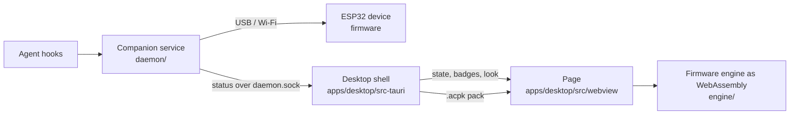

# Desktop Agent Companion - developer notes

The ESP32 Agent Companion's character in a transparent window on the desktop.
The user-facing summary is in the [root README](../README.md#desktop-agent-companion).

## How the pieces fit



There is one of everything:

- **One animation engine.** [`engine/engine.cpp`](engine/engine.cpp) compiles the
  firmware's own `CharacterMotion`, `SpriteMotion`, `SpriteRenderer`,
  `FullFrameRenderer`, `CharacterEffects` and `AgentBadges` from
  [`../firmware/AgentCompanion/src`](../firmware/AgentCompanion/src) to
  WebAssembly, unchanged. The wrapper does only what `AgentCompanion.ino` does
  around them: it owns the frame buffers, applies mode changes, and steps the
  engine once per frame.
- **One kind of pack.** The page loads the same `.acpk` file the device installs,
  from `build/characters` or from the characters added in Settings.
- **One source of truth.** The Rust shell polls the daemon's `status` every
  400 ms. That gives it the state, the agent badges (already filtered by the
  badge setting and cut to four, as the device gets them), the character and its
  pack file, and the desktop settings (shown or hidden, and the look). The desktop has no hooks, no state
  coordinator and no settings of its own.

## Building

```bash
python3 tools/character_pack.py build   # from the repository root: the .acpk packs
cd desktop
npm install
npm start            # builds the page and app icon, then cargo run --release
npm test             # typecheck, engine freshness, parity and cut-out tests
npm run bundle -w @agent-companion/desktop   # the installable app, as releases ship it
```

The engine is committed, in [`engine/prebuilt`](engine/prebuilt): one 110 KB
JavaScript file with the WebAssembly embedded, so the app builds with Rust and
Node alone. Only a change to the engine or to the firmware's animation code needs
a rebuild, with Emscripten (`em++` on `PATH`: `brew install emscripten` on
macOS, or [emscripten.org](https://emscripten.org)):

```bash
npm run build:engine   # then commit desktop/engine/prebuilt
```

`engine/prebuilt/sources.sha256` records what it was built from, and a test
fails until it is rebuilt after such a change. Tagged releases build the app for
macOS (universal `.dmg`), Windows (installer) and Linux (x86_64 AppImage and
`.deb`) and attach it to the GitHub Release, with first-run steps for each.

## Matching the device exactly

[`engine/test/parity.test.mjs`](engine/test/parity.test.mjs) builds the
repository's native character preview (`tools/character_preview.cpp`: the same
firmware sources, compiled for the host). It runs that beside the WebAssembly
engine with the same seed, and steps both through idle, working, attention,
complete, surprise and idle again. It checks that every pixel of every frame
matches, for Copilot, Claude and OpenClaw. Any change to the firmware's
animation code reaches the desktop at the next build, and CI fails if the two
ever disagree.

## The look

By default, the window is a small copy of the device: the round screen in a
matte black case, with the two buttons on its right edge. Light from the top
left catches the case's rim and the bevel into the screen. The page draws the
case in the canvas around the engine's frame, and the frame is the device's own
pixels on its own black screen, so it reads exactly as the device does.

With **Show the device around the character** turned off, the character sits straight on the desktop, so the
engine keys the frame (`writeRgba` in `engine.cpp`):

- Black that connects to the edge of the round display is background. Black
  that the art encloses (inside a face) is kept. This is a flood fill from the
  edges, so dark seams and shadowed interiors survive however dark they are.
- The engine renders the character, keeps a copy, then renders the effects.
  Pixels that the effects changed over the background get their brightness
  back as alpha, because the device blends effects against black. A fading
  digit is then a fading digit, not a dark smudge.
- The badge disc's dark fill stays opaque, as it is on the device.

## Keeping it light

A desktop pet runs all day, so it is measured, not assumed. These are the
figures on an Apple Silicon Mac (release build, all four processes the app
uses, WebKit's included), as a share of one CPU core:

| State | CPU | Memory |
| --- | --- | --- |
| Idle | about 3% | 35 MB app, 43 MB page, 7 MB network, 245 MB WebKit GPU |
| Working (effects every frame) | about 7% | the same, flat over a 4-minute soak |
| Hidden | 0.3% | WebKit's GPU memory drops to 16 MB |

What keeps it there:
- **30 frames a second, as on the device** (`kTargetFps`), on a timer, not at
  the display's refresh rate, which can be 120 Hz.
- **Only what changed is converted and uploaded.** The engine compares each
  frame with the last in 32x32 tiles, converts only changed tiles, and lists
  them as rectangles; the page uploads only those to one WebGL2 texture. An
  unchanged frame costs one engine step and nothing else.
- **Premultiplied pixels.** The engine writes what the GPU composites, so
  WebKit does not convert each upload, which profiling showed was its hottest
  path. A 2D canvas fed by `putImageData` cost a new GPU surface per frame
  (about 400 MB of GPU memory, and more CPU); a per-frame `ImageBitmap` was
  worse still. WebGL 1 and a 2D canvas remain only as fallbacks.
- **The frame is shown at its own size**, scaled by CSS, and **the case is
  drawn once per size** on its own canvas.
- **The "character only" cut-out is cached** while only the effects move; a
  test checks it matches a fresh cut-out.
- **The pack is held once.** The page writes it straight into the engine.
- **A small shell.** One async worker instead of one per core. On macOS the
  cursor is read from Core Graphics, not through the main thread; the window's
  place comes from window events. The cursor is checked 20 times a second near
  the window, 7 times far from it, and once a second while hidden.
- **Hidden means stopped**: no engine steps and no drawing.

The floor is WebKit's: about 240 MB of GPU memory while anything on the page
animates, which it releases when nothing does. Going below that would mean a
native renderer instead of a WebView.

## Credits and licensing

The Desktop Agent Companion is by Darren Robinson, made with Dan Wahlin's
approval. The window itself (the transparent, click-through, draggable pet with
its tray, placement memory and multi-monitor checks) is his work, in
[apps/desktop](apps/desktop/README.md). The animation engine is the ESP32
Agent Companion firmware.

The repository carries no LICENSE file, so that approval is what settles reuse.
`copilot` renders a character of GitHub's, `claude` one of Anthropic's and
`openclaw` one of the OpenClaw project's.
